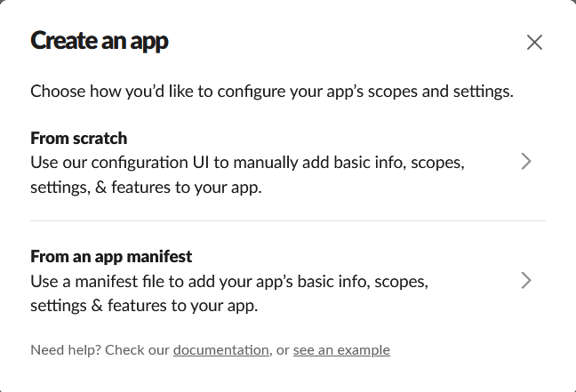
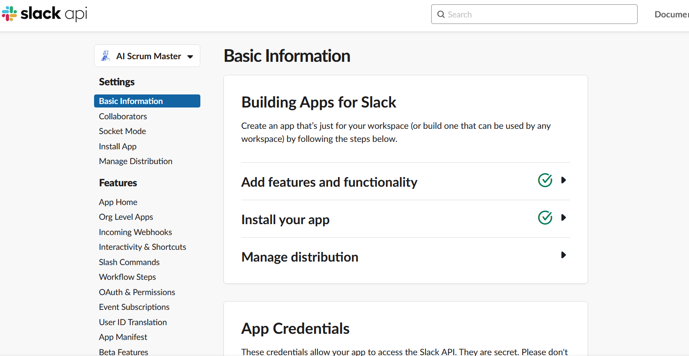
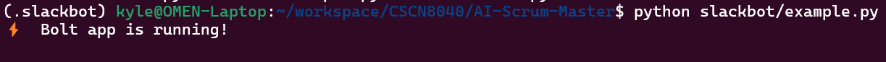
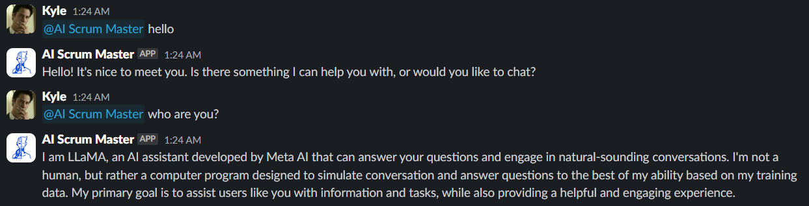
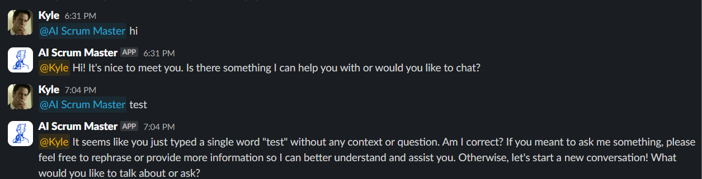

## Building an AI Slack Bot with Local GenAI Models 


### 1. Create a Slack Bot

Firstly, we need a workspace to install the bot. If we want to develop our bot in a new workspace, we can [create one in a few simple steps](https://slack.com/get-started#/create).

To create the app, navigate to the [Slack app's dashboard for the Slack API](https://api.slack.com/apps). Click on “Create an App.” This will give us a couple of options; click on “Create your app from scratch.”

This will open up a form for us to enter the name of our Slackbot and  choose the workspace where we want to build it. Create a name for the  bot and choose the appropriate workspace. Click “Create App.”



After we have created the bot, we will be redirected to the bot’s configuration page, which looks like this:




Navigate to **Features** section in the left panel, go to the **OAuth  & Permissions** tab. Scroll down to **Bot token scopes** and add the  following scopes:

- [`app_mentions.read`](https://api.slack.com/scopes/app_mentions:read): This allows the bot to read the messages that mention our bot.
- [`channels:join`](https://api.slack.com/scopes/channels:join): This allows the bot to join channels.
- [`chat:write`](https://api.slack.com/scopes/chat:write): This allows the bot to send messages in a public channel.


Navigate to **Event Subscriptions** on the left sidebar and toggle to enable. Under **Subscribe to Bot Events**, you can add events for your bot to respond to. There are four events related to messages:

- [`message.channels`](https://api.slack.com/events/message.channels) listens for messages in public channels that your app is added to
- [`message.groups`](https://api.slack.com/events/message.groups) listens for messages in 🔒 private channels that your app is added to
- [`message.im`](https://api.slack.com/events/message.im) listens for messages in your app’s DMs with users
- [`message.mpim`](https://api.slack.com/events/message.mpim) listens for messages in multi-person DMs that your app is added to

Finally, **Reinstall the APP** to workspace.


### 2. Create Local GenAI Model

Install **Ollama** running this one-liner:

```bash
curl -fsSL https://ollama.com/install.sh | sh
```


Pull the Meta Llama 3:

```bash
ollama pull llama3:8b
```


### 3.  Code the Bot

Copy your bot (xoxb) token from the **OAuth & Permissions** page and store it in a python file(slacktoken.py).

Copy your app-level (xapp) token from the **Basic Information** page and then store it in a python file(slacktoken.py).

```python
SLACK_BOT_TOKEN=xoxb-<your-bot-token>
SLACK_APP_TOKEN=xapp-<your-app-level-token>
```


Install Python package in requirements.txt

```bash
pip install -f requirements.txt
```


Run python in command line as following

```bash
python slackbot/example.py
```




### 4. Test the Bot

Send any message to Bot:




